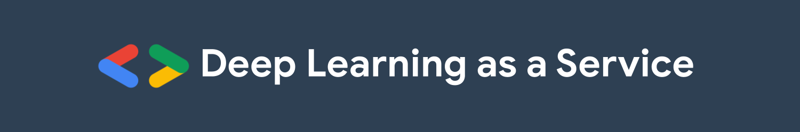

  
  
  

## Descripción

En la actualidad, diversas compañías están mudando a ofrecer servicios en la nube, y las soluciones de inteligencia artificial no son una excepción. En este taller se creará un servicio que utilice algún modelo de aprendizaje de máquina entrenado, a través de una API REST. Todo ello con el poder de TensorFlow de Google y Flask.

La idea será introducir lo que es AIaaS (en particular DLaaS) y entrenar una red neuronal profunda para resolver algún problema específico utilizando TensorFlow y Google Colab; tras ello, guardar el modelo entrenado para montarlo a través de una API construida sobre Flask.

Para este taller se necesitan conocimientos intermedios-avanzados sobre programación en Python o algún otro lenguaje; y conocimiento básico o NULO sobre Deep Learning (para esto es el taller). Parte de los objetivos es que posterior al taller se cuente con material y conocimientos para poder desarrollar modelos de IA como servicio; con Python, por supuesto. Para el taller se proporcionará código base para a partir de ahí montar el servicio.

## Contenido del taller

### Día 1 

- Motivación - DL como un servicio
- Motivación - Reconocimiento de actividad
- Introducción al Deep Learning
- Redes neuronales convolucionales

### Día 2

- Creación de modelos
- Solución a problema específico
- Servicios web - APIs
- Empaquetado y servicio de modelos

Puedes encontrar los slides en vivo [**AQUÍ**](https://docs.google.com/presentation/d/e/2PACX-1vRRSB-eQbdNcNd-HualwxsZR1DAkeCczYiW_v9Kd6HmYWUQ8heCKMzb7ycRPGNHgWtAVYjFkauQUOsr/pub?start=false&loop=false&delayms=3000).

> Es importante mencionar que el curso hará uso de un ambiente en la nube para el desarrollo del material; sin embargo, podrás ejecutar el código de manera local si cuentas con los requerimeintos necesarios.

## Instrucciones para estudiantes

El código y los ejercicios se desarrollarán en Python 3.7+ usando [TensorFlow](https://www.tensorflow.org/), que adopta a [Keras](https://www.tensorflow.org/versions/r2.0/api_docs/python/tf/keras) como interfaz de alto nivel para construir y entrenar redes neuronales.

#### Requerimientos:
* Una laptop.
* Este repositorio de GitHub clonado y actualizado antes del taller.
* Un sentido aventurero en los datos y la IA.
* Un ambiente Python 3.7+ con Anaconda (en casod e querer ejecutar el código de manera local).

Los talleres serán impartidos usando *notebooks* de Jupyter, documentos con código ejecutable, texto, ecuaciones, visualizaciones, imágenes y demás material. Los *notebooks* se pueden crear y ejecutar en la nube vía Google Colab o de manera local en tu computadora a través de [Jupyter Notebooks o JupyterLab](https://jupyter.org/).

Para fines prácticos de este taller (al ser online) utilizaremos Google Colab.

### Google Colab

[Colab](https://colab.research.google.com) es un servicio de Google para ejecutar *notebooks* en la nube. Provee ambientes de Python 2 y 3 con CPUs, GPUs y TPUs. ¡Y es gratis! Solo necesitas tener una cuenta de Google o crear una.

Recomendamos que elijas un ambiente con Python 3 y GPU. Para activarlo:

* Abre el menú `Entorno de ejecución`
* Elige la opción `Restablecer todos los entornos de ejecución...` .
* Vuelve a abrir `Entorno de ejecución`
* Elige `Cambiar tipo de entorno de ejecución`
* Selecciona Python 3 como `Tipo de ejecución` y GPU de la lista de `Acelerador por hardware`

La siguiente captura de pantalla ilustra este proceso.

En [Colab](https://colab.research.google.com) puedes crear un nuevo *notebook*, subir uno existente desde tu computadora o importarlo de Google Drive o GitHub.
